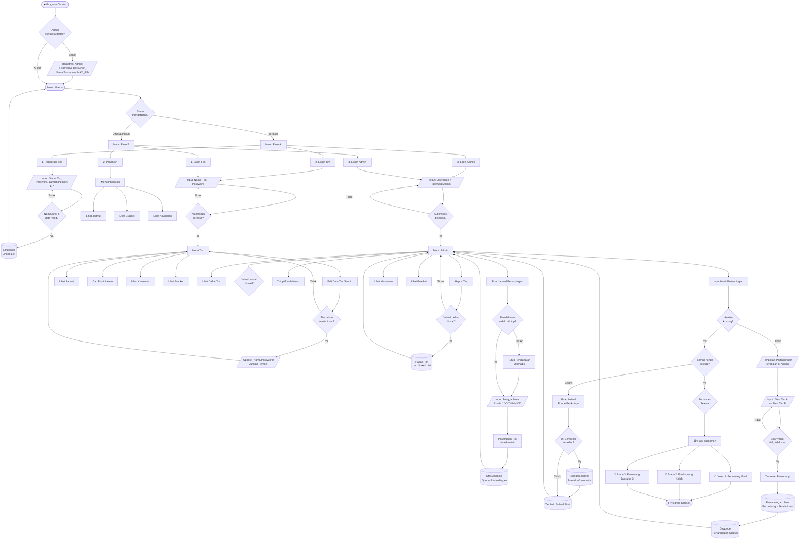

# 🏆 Sistem Manajemen & Penjadwalan Turnamen

Aplikasi berbasis **Command Line Interface (CLI)** menggunakan C++ untuk mengelola turnamen kompetitif dengan sistem **eliminasi tunggal (_single elimination_)** dan **perebutan juara ke-3**. Program ini dirancang secara modular menggunakan berkas `*.cpp` terpisah, tanpa file header (`*.h`), dengan keterhubungan antar-berkas diatur melalui `#include` di dalam `main.cpp`.

---

## 📋 Daftar Isi

1. [Fitur Utama](#-fitur-utama)
2. [Struktur Data yang Digunakan](#-struktur-data-yang-digunakan)
3. [Struktur Berkas Proyek](#-struktur-berkas-proyek)
4. [Hak Akses Pengguna](#-hak-akses-pengguna)
5. [Alur Program](#-alur-program)
6. [Flowchart Program](#-flowchart-program)
7. [Detail Spesifikasi Teknis](#-detail-spesifikasi-teknis)
8. [Cara Kompilasi dan Menjalankan](#%EF%B8%8F-cara-kompilasi-dan-menjalankan)

---

## ✨ Fitur Utama

| Fitur | Keterangan |
|-------|-----------|
| 🔐 Registrasi Admin | Admin didaftarkan sekali saat program pertama dijalankan |
| ⚙️ Konfigurasi Turnamen | Admin menetapkan nama turnamen dan kapasitas tim (`MAX_TIM`, harus pangkat 2) |
| 📝 Registrasi Tim | Tim mendaftar dengan nama, password, dan jumlah pemain (1–7 orang) |
| 📅 Penjadwalan Otomatis | Braket Ronde 1 dibuat dengan pengacakan _head-vs-tail_ |
| 🏅 Input Hasil Pertandingan | Skor diinput per pertandingan; tim kalah otomatis tereliminasi |
| 🔄 Jadwal Ronde Berikutnya | Dibuat otomatis dengan selisih hari sesuai fase (ronde biasa/semifinal/final) |
| 🥉 Perebutan Juara ke-3 | Dijadwalkan otomatis setelah semifinal selesai, sehari sebelum final |
| 📊 Klasemen Real-time | Diurutkan berdasarkan poin kemenangan menggunakan Bubble Sort |
| 🗂️ Tampilan Bracket | Visualisasi bagan eliminasi turnamen di terminal |
| 👁️ Mode Penonton | Akses publik setelah pendaftaran ditutup/penuh |

---

## 🗃️ Struktur Data yang Digunakan

| Struktur Data | Digunakan Untuk |
|--------------|----------------|
| **Singly Linked List** | Menyimpan daftar tim secara dinamis (`struct Tim`) |
| **Queue berbasis Linked List** | Mengelola antrian jadwal pertandingan secara FIFO (`struct NodeAntrian`) |
| **Bubble Sort** | Mengurutkan klasemen secara _descending_ berdasarkan poin kemenangan |
| **Linear Search** | Mencari tim berdasarkan nama di dalam Linked List |

---

## 📂 Struktur Berkas Proyek

```
strukturData/
└── src/
    ├── main.cpp                        ← Driver utama & menu Admin/Tim/Penonton
    ├── umum/
    │   ├── models.cpp                  ← Struct data, variabel global, queue
    │   ├── search_sort.cpp             ← Linear Search & Bubble Sort
    │   ├── lihat_jadwal.cpp            ← Tampilkan antrian jadwal pertandingan
    │   ├── lihat_bracket.cpp           ← Tampilkan bagan eliminasi turnamen
    │   └── lihat_klasemen.cpp          ← Tampilkan klasemen berdasarkan poin
    ├── admin/
    │   ├── registrasi_admin.cpp        ← Pendaftaran admin & konfigurasi MAX_TIM
    │   ├── login_admin.cpp             ← Autentikasi administrator
    │   ├── hapus_tim.cpp               ← Hapus tim (sebelum braket dibuat)
    │   ├── buat_jadwal.cpp             ← Buat jadwal Ronde 1 (head-vs-tail)
    │   └── input_hasil.cpp             ← Input skor & buat jadwal ronde berikutnya
    ├── tim/
    │   ├── registrasi_tim.cpp          ← Pendaftaran tim baru
    │   ├── login_tim.cpp               ← Autentikasi tim
    │   ├── edit_tim.cpp                ← Edit data tim sendiri
    │   ├── lihat_tim.cpp               ← Lihat seluruh tim terdaftar
    │   └── cari_lawan.cpp              ← Cari & lihat profil tim lawan
    ├── tampilan/
    │   ├── header.cpp                  ← Header utama, subjudul, border menu CLI
    │   ├── pesan.cpp                   ← Pesan status: OK, ERROR, WARNING, INFO
    │   └── tabel.cpp                   ← Render tabel dengan border Unicode
    └── hapus_terminal/
        └── utils.cpp                   ← clearScreen() lintas platform
```

### Deskripsi Modul

#### 🔧 Utilitas & Tampilan
| Berkas | Fungsi |
|--------|--------|
| [`src/umum/models.cpp`](src/umum/models.cpp) | Definisi `struct Tim` (Linked List), `struct NodeAntrian` (Queue), variabel global, fungsi queue, dan `adalahPangkatDua()` |
| [`src/umum/search_sort.cpp`](src/umum/search_sort.cpp) | `cariTim()` (Linear Search) dan `urutkanKlasemen()` (Bubble Sort) |
| [`src/hapus_terminal/utils.cpp`](src/hapus_terminal/utils.cpp) | `clearScreen()` lintas platform (Windows/Linux/macOS) |
| [`src/tampilan/header.cpp`](src/tampilan/header.cpp) | `tampilHeader()`, `tampilSubjudul()`, `tampilPilihanMenu()`, `tampilMenuBottom()`, `tampilPromptKembali()`, `tampilPromptLanjut()` |
| [`src/tampilan/pesan.cpp`](src/tampilan/pesan.cpp) | `pesanOK()`, `pesanError()`, `pesanWarning()`, `pesanInfo()` |
| [`src/tampilan/tabel.cpp`](src/tampilan/tabel.cpp) | `tampilGarisTabel()`, `tampilBarisTabel()` — render tabel dengan border Unicode |

#### 🛡️ Modul Admin
| Berkas | Fungsi |
|--------|--------|
| [`src/admin/registrasi_admin.cpp`](src/admin/registrasi_admin.cpp) | `daftarAdmin()` — pendaftaran admin & konfigurasi `MAX_TIM` |
| [`src/admin/login_admin.cpp`](src/admin/login_admin.cpp) | `loginAdmin()` / `masukAdmin()` — autentikasi administrator |
| [`src/admin/hapus_tim.cpp`](src/admin/hapus_tim.cpp) | `hapusTim()` — hapus tim sebelum braket dibuat |
| [`src/admin/buat_jadwal.cpp`](src/admin/buat_jadwal.cpp) | `buatJadwal()`, `tambahHari()` — buat jadwal Ronde 1 |
| [`src/admin/input_hasil.cpp`](src/admin/input_hasil.cpp) | `inputHasil()`, `buatJadwalBerikutnya()` — input skor & jadwal ronde berikutnya |

#### 👥 Modul Tim
| Berkas | Fungsi |
|--------|--------|
| [`src/tim/registrasi_tim.cpp`](src/tim/registrasi_tim.cpp) | `daftarTim()` — pendaftaran tim baru |
| [`src/tim/login_tim.cpp`](src/tim/login_tim.cpp) | `masukTim()` → return `Tim*` |
| [`src/tim/edit_tim.cpp`](src/tim/edit_tim.cpp) | `editDataTim()`, `menuEditTim()`, `editTim()` |
| [`src/tim/lihat_tim.cpp`](src/tim/lihat_tim.cpp) | `tampilkanTim()` |
| [`src/tim/cari_lawan.cpp`](src/tim/cari_lawan.cpp) | `cariTim()` — cari & tampilkan profil tim lawan |

#### 👁️ Modul Umum / Penonton
| Berkas | Fungsi |
|--------|--------|
| [`src/umum/lihat_jadwal.cpp`](src/umum/lihat_jadwal.cpp) | `tampilJadwal()` — tampilkan antrian jadwal pertandingan |
| [`src/umum/lihat_bracket.cpp`](src/umum/lihat_bracket.cpp) | `tampilBracket()` — tampilkan bagan eliminasi |
| [`src/umum/lihat_klasemen.cpp`](src/umum/lihat_klasemen.cpp) | `tampilKlasemen()` — tampilkan klasemen terurut |

---

## 🔐 Hak Akses Pengguna

### 🛡️ Admin
Login dengan akun yang didaftarkan saat program pertama berjalan.

| Akses | Keterangan |
|-------|-----------|
| Lihat daftar tim | Melihat semua tim yang terdaftar |
| Edit data tim | Mengedit semua tim |
| Hapus tim | Hanya sebelum braket dibuat |
| Tutup pendaftaran | Secara manual sebelum kuota penuh |
| Buat jadwal Ronde 1 | Pengacakan _head-vs-tail_ |
| Buat jadwal ronde berikutnya | Setelah semua pertandingan ronde selesai |
| Input hasil pertandingan | Memasukkan skor & mengeliminasi tim kalah |
| Lihat klasemen | ✓ |
| Lihat bracket | ✓ |

### 👥 Tim
Login menggunakan **nama tim** (username) + **password**.

| Akses | Keterangan |
|-------|-----------|
| Edit data tim sendiri | Hanya selama belum tereliminasi |
| Lihat jadwal pertandingan | ✓ |
| Cari profil tim lawan | ✓ |
| Lihat klasemen | ✓ |
| Lihat bracket | ✓ |

### 👁️ Penonton
Tanpa login. Opsi ini muncul di Menu Utama setelah pendaftaran ditutup atau penuh.

| Akses | Keterangan |
|-------|-----------|
| Lihat jadwal pertandingan | ✓ |
| Lihat bracket/bagan turnamen | ✓ |
| Lihat klasemen | ✓ |

---

## 🔄 Alur Program

### Tahap 1 — Registrasi Administrator (Pertama Kali Dijalankan)
Saat program pertama dibuka, pengguna **wajib** mendaftarkan akun Administrator:
- Username Admin
- Password Admin
- Nama Turnamen
- Kapasitas Maksimal Tim (`MAX_TIM`) — harus pangkat 2 (min. 2, contoh: 2, 4, 8, 16, 32...)

### Tahap 2 — Menu Utama Dinamis

Menu Utama berubah otomatis berdasarkan status pendaftaran:

**Fase A — Pendaftaran Terbuka** *(Tim < MAX_TIM dan belum ditutup oleh Admin)*
```
1. Registrasi Tim
2. Login Tim
3. Login Admin
0. Keluar Program
```

**Fase B — Pendaftaran Ditutup / Penuh** *(Tim >= MAX_TIM atau ditutup manual oleh Admin)*
```
1. Login Tim
2. Penonton
3. Login Admin
0. Keluar Program
```
> Opsi registrasi tim menghilang dan diganti dengan opsi **Penonton**.

### Tahap 3 — Admin Menutup Pendaftaran & Membuat Braket
1. Admin login → pilih **Tutup Pendaftaran** *(opsional jika kuota belum penuh)*
2. Admin → pilih **Buat Jadwal Pertandingan**
3. Admin memasukkan tanggal mulai Ronde 1 (`YYYY-MM-DD`)
4. Sistem otomatis memasangkan tim secara _head-vs-tail_ (Tim 1 vs Tim N, dst.) dan memasukkan ke antrian pertandingan (Queue)

### Tahap 4 — Input Hasil Pertandingan (Ronde per Ronde)
1. Admin → pilih **Input Hasil Pertandingan**
2. Admin memilih tim pemenang pada pertandingan terdepan di antrian
3. Sistem otomatis:
   - Menandai tim yang kalah sebagai **tereliminasi**
   - Memberikan **+1 poin** kemenangan kepada pemenang
   - Mengeluarkan pertandingan dari antrian (Dequeue)
4. Skor valid: `0–3`, tidak boleh negatif, tidak boleh seri

### Tahap 5 — Buat Jadwal Ronde Berikutnya
Setelah semua pertandingan satu ronde selesai (antrian kosong):

| Fase | Selisih Hari |
|------|-------------|
| Ronde biasa | +3 hari dari pertandingan terakhir |
| Semifinal | +4 hari dari pertandingan terakhir |
| Final | +5 hari dari pertandingan terakhir |
| Perebutan Juara ke-3 | Hari Final - 1 (otomatis masuk antrian setelah semifinal) |

### Tahap 6 — Logika Juara ke-3 & Final
- Setelah semifinal selesai, pertandingan **Perebutan Juara ke-3** dijadwalkan otomatis (sehari sebelum Final)
- **Pemenang Perebutan Juara ke-3** → 🥉 Peringkat ke-3
- **Pemenang Final** → 🥇 Juara 1
- **Finalis yang kalah** → 🥈 Juara 2

---

## 📊 Flowchart Program



---

## 🔩 Detail Spesifikasi Teknis

### 1. Struktur Data (`models.cpp`)

**`struct Tim` — Node Singly Linked List**
```cpp
struct Tim {
    string nama;           // Nama tim (sekaligus username login)
    string password;
    int    jumlahPemain;   // Nilai valid: 1–7
    int    poin;           // Bertambah +1 per kemenangan
    bool   tereleminasi;
    Tim   *berikutnya;     // Pointer ke node berikutnya
};
```

**`struct NodeAntrian` — Node Queue Pertandingan**
```cpp
struct NodeAntrian {
    Tim           *timA;
    Tim           *timB;
    string         tanggalTanding;
    string         ronde;
    NodeAntrian   *berikutnya;
};
```

**Fungsi Queue**
| Fungsi | Keterangan |
|--------|-----------|
| `tambahAntrian(timA, timB, tanggal, ronde)` | Enqueue — menambah pertandingan ke antrian |
| `hapusAntrian()` | Dequeue — menghapus pertandingan dari depan antrian |
| `antrianKosong()` | Mengecek apakah antrian pertandingan kosong |

### 2. Aturan Bisnis Turnamen

**Kapasitas Tim**
- `MAX_TIM` ditetapkan oleh Admin saat pertama kali program berjalan
- Nilainya **wajib pangkat 2** (contoh: 2, 4, 8, 16, 32...)

**Batas Pemain per Tim**
- Minimal **1** pemain, maksimal **7** pemain

**Aturan Penjadwalan Tanggal**

| Fase | Aturan |
|------|--------|
| Ronde 1 | Input manual oleh Admin (`YYYY-MM-DD`) |
| Ronde biasa berikutnya | +3 hari dari tanggal pertandingan terakhir ronde sebelumnya |
| Semifinal | +4 hari dari pertandingan terakhir |
| Perebutan Juara ke-3 | Hari Final − 1 hari (otomatis setelah semifinal selesai) |
| Final | +5 hari dari pertandingan terakhir |

**Skor & Poin**
- Skor valid per tim: **0–3** per pertandingan
- Tidak boleh negatif, tidak boleh seri (sistem gugur)
- Tim pemenang mendapatkan **+1 poin** ke dalam klasemen

---

## 🛠️ Cara Kompilasi dan Menjalankan

Karena proyek menggunakan pendekatan _Single-File Architecture_ (semua modul digabungkan lewat `#include *.cpp` di `main.cpp`), cukup kompilasi **satu berkas saja**:

### Linux / macOS
```bash
g++ src/main.cpp -o sistem_turnamen
./sistem_turnamen
```

### Windows (MinGW / Git Bash)
```bash
g++ src/main.cpp -o sistem_turnamen.exe
./sistem_turnamen.exe
```

> **Catatan**: Tidak diperlukan flag tambahan. Semua dependensi diresolvasi melalui `#include` di dalam `main.cpp`.
